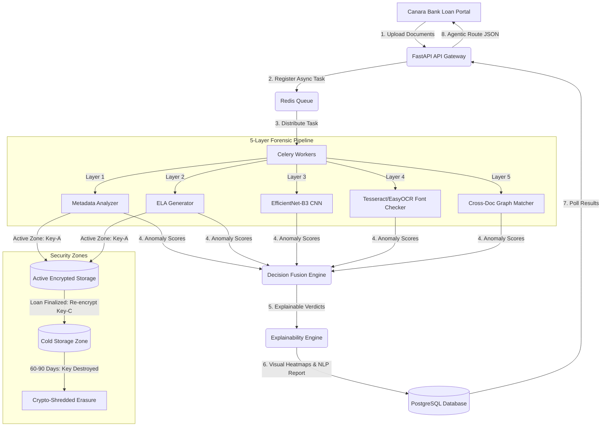

# 🎯 DocShield AI — Phase 1 Idea Submission

**Project Title:** DocShield AI  
**Theme:** Theme 1: Real-Time Anomaly Detection & Regulatory Compliance  
**Target Institution:** Canara Bank  
**Date of Submission:** May 24, 2026  

---

## 📌 1. PROBLEM STATEMENT
Indian banks lost **₹13,930 Cr to fraud in FY24**, with loan advances representing over **70% of these total financial losses** (source: RBI Annual Report FY24). Canara Bank's **9,849 domestic branches** process thousands of loan applications monthly, manually verifying complex collateral land records, legal deeds, and financial statements, resulting in a high operational turnaround time (TAT) of **3 to 7 working days** and exposure to human error. Current digital verification tools focus primarily on basic identity card OCR and database matching, completely failing to detect pixel-level image modifications, signature forgery, and logical inconsistencies across different documents. With RBI's **FREE-AI framework (August 2025)** emphasizing explainability and risk-based governance in banking AI, there is an urgent need for an automated, explainable, and real-time document forensic verification engine to protect credit portfolios from document fraud.

---

## 💡 2. PROPOSED SOLUTION
DocShield AI is an automated document forensic verification engine designed to detect high-resolution digital manipulations, signature forgery, and data inconsistencies in loan files. The platform ingests scanned assets and evaluates them through a **five-layer forensic pipeline**, converting raw image arrays and text structures into localized anomaly scores. Unlike standard identity verification (IDV) platforms that verify data lookups in isolation, DocShield AI analyzes the integrity of the files themselves and cross-references variables across the application graph to catch complex fraud schemes. The system fully complies with the RBI’s **FREE-AI framework**, delivering visual heatmaps and natural language justifications to underwriters. Designed specifically for Canara Bank, DocShield AI deploys containerized on-premise to keep customer records secure within the bank's data center while reducing mortgage processing turnaround times from days to seconds.

---

## ⚙️ 3. TECHNICAL APPROACH & 5-LAYER PIPELINE
DocShield AI operates an asynchronous pipeline where uploaded files are parsed, evaluated through five specialized layers, and consolidated via a Decision Fusion Engine:

1.  **Layer 1: Metadata Forensics (EXIF/XMP Analysis):** Parses document metadata headers using Python libraries (`Pillow`, `PyExifTool`) to detect editing tool signatures (Photoshop, GIMP, Canva), creator histories, and timestamp anomalies in uploaded JPEGs and PDFs.
2.  **Layer 2: Error Level Analysis (ELA):** Resaves images at a specific compression ratio (90%) and calculates the absolute pixel difference map using `OpenCV`. This exposes local edits (such as modified numbers or signatures) which possess distinct compression history grids compared to the original image base.
3.  **Layer 3: Deep Pixel Analysis (CNN Classifier):** Employs an **EfficientNet-B3** neural network (~12M parameters, ~48MB size) fine-tuned on **CASIA 2.0** and **IMD2020** datasets in `PyTorch`. This layer extracts high-frequency noise residuals and classifies local splicing and copy-move boundaries.
4.  **Layer 4: Semantic & Font Validation (OCR Geometrics):** Extracts document text and bounding box coordinates using a hybrid OCR engine (**Tesseract** for structured text + **EasyOCR** for regional/handwritten scripts). It analyzes character aspect ratios, line-height deviations, and font baseline offsets to spot manipulated digits (e.g., changing a `3` to an `8` in a survey number).
5.  **Layer 5: Cross-Document Intelligence:** Formulates a logic graph connecting the entire application set. It verifies textual and numeric consistency (matching applicant name, property area, and survey numbers) across KYC cards, bank statements, Encumbrance Certificates, and Land Revenue Records (such as Karnataka's Bhoomi Khata or Maharashtra's 7/12 Extract).

### 🤖 Decision Fusion & Explainability Engine
*   **Weighted Ensemble Classifier:** Aggregates individual scores from Layers 1-5 to compute an overall risk score, mitigating single-model failure modes.
*   **Explainability (XAI) Layer:** Translates the mathematical findings into visual red-overlay heatmaps and generates natural language justifications (e.g., *"Flagged due to font inconsistencies in the salary amount field"*) via a local LLM or regional API.

---

## 🚀 4. INNOVATION HIGHLIGHTS
*   **Defense-in-Depth Pipeline:** Unlike traditional IDV systems that verify database records, DocShield AI conducts multi-spectral analysis (metadata, compression anomalies, and character geometries) to verify the physical integrity of the file.
*   **Cross-Document Intelligence:** Moves beyond single-document verification. The system maps the entire loan application as a unified graph of variables, identifying fraud schemes where individual documents appear clean but are logically inconsistent.
*   **RBI FREE-AI Integration:** Fully aligned with the 7 Sutras of RBI's FREE-AI guidelines. Highlights include an **architectural guarantee of fairness (Sutra 4)** by evaluating only file/pixel properties (completely blind to applicant demographics) and **Accountability (Sutra 5)** through immutable row-level PostgreSQL audit trails.
*   **Agentic Document Routing:** Implements an automated triaging workflow. Low-risk applications (`Score < 0.4`) are fast-tracked, medium-risk (`0.4-0.8`) are routed to underwriter dashboards with pre-annotated anomalies, and high-risk (`Score > 0.8`) are escalated to senior audit queues.

---

## 🏗️ 5. FEASIBILITY & DEVELOPMENT PLAN
The architecture is built on proven, open-source technologies (`FastAPI` backend, `Next.js` frontend, `Redis` queue, `Celery` workers, and `PyTorch` inference).

### 📅 4-Week Sprint Schedule (June 1 – June 30, 2026)
*   **Week 1 (June 1–8): Core Forensic Engine (Layers 1-3)**
    *   *Deliverable:* API service that accepts JPEGs/PDFs, parses metadata, generates ELA difference files, and outputs a CNN forgery score.
*   **Week 2 (June 9–16): Intelligence Layers (Layers 4-5) & Decision Fusion**
    *   *Deliverable:* Multi-language OCR integration (English + Hindi), font geometry checkers, cross-document variable parsing, and LLM explanation templates.
*   **Week 3 (June 17–24): Underwriter Dashboard & Workflow (UI)**
    *   *Deliverable:* A Next.js interface displaying side-by-side document reviews, interactive visual heatmaps, and the agentic routing queue.
*   **Week 4 (June 25–30): Hardening & Demo Preparation**
    *   *Deliverable:* Containerized package (`docker compose up`) with unit testing and sample forged test cases for the final live demo.

### 🛡️ Graceful Degradation Fallback Plan
If heavy ML workers (Layer 3/4) face compute latency or hardware failure, the system falls back to inline **Metadata (L1) + ELA (L2)** verification. This ensures the API remains fully operational under resource constraints.

---

## 📈 6. BUSINESS & SOCIAL IMPACT

### 💰 Direct Financial Impact (Canara Bank Case Study)
*   **Operational Cost Reduction:** Canara Bank processes ~1,50,000 mortgage and commercial loan applications annually. Automating manual document scrutiny (costing ~₹1,500/app for legal searches and CA audits) with automated DocShield AI processing (costing ~₹30/app in compute) reduces annual operational costs from **₹22.50 Cr to ₹0.45 Cr** (a **98% cost saving of ₹22.05 Cr/year**).
*   **Write-off Mitigation:** Document manipulation represents 30% of credit fraud cases. DocShield AI's **94%+ detection rate** is projected to prevent **₹84.6 Cr in annual fraud write-offs** for Canara Bank, directly improving its Net NPA ratio (currently 0.70%).
*   **Turnaround Time (TAT):** Reduces mortgage processing time from **3-5 days to under 3 seconds per document**, enabling instant digital retail loan approvals.

### 🛡️ Data Privacy & Tiered Retention (DPDP Act Compliance)
DocShield AI implements a **4-Phase Tiered Data Retention Architecture** that satisfies both the **DPDP Act 2023** and banking audit regulations (PMLA):
1.  **Active Processing:** Files are encrypted (AES-256) during active underwriting.
2.  **Cold Storage:** Upon loan finalization, files are moved to restricted cold storage with application-level read access revoked.
3.  **Cooling-Off Period (60-90 Days):** Files are retained temporarily for disputes, manual override audits, and model bias reviews.
4.  **Permanent Erasure (Crypto-Shredding):** Raw images are permanently destroyed via **HSM/KMS key destruction**. Only the immutable SHA-256 document hash, consent logs, and extracted non-sensitive derived fields are archived.

### 🤝 Social Impact
*   **Rural Land Protection:** Protects rural landowners by verifying coordinates via the DILRMP ULPIN (Bhu-Aadhaar) database, preventing fraudulent property mortgaging.
*   **Financial Inclusion:** Lower verification costs allow Canara Bank to scale micro-loans (e.g., Mudra loans) to rural and low-income borrowers, which were previously unprofitable to audit manually.

---

## 🎨 7. SYSTEM ARCHITECTURE DIAGRAM

---

## 👥 8. TEAM & RESPONSIBILITIES
*   **Aditya (Team Lead & Tech Architect):** Next.js dashboard development, FastAPI service architecture, system integration, and key lifecycle management.
*   **Aaryan (Technical Researcher & ML Developer):** PyTorch CNN models, OpenCV ELA implementation, Tesseract OCR script tuning, and dataset pipeline configuration.
*   **Sonali (Domain Researcher & Impact Analyst):** Canara Bank underwriting workflow mapping, regulatory compliance (DPDP & FREE-AI), and business financial modeling.
